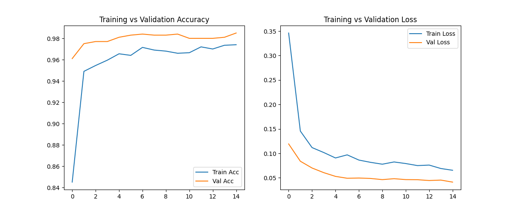

# Cat & Dog Image Classification 🐱🐶

This project uses a deep learning model to classify images of cats and dogs. It leverages transfer learning with the MobileNetV2 architecture, built using TensorFlow and Keras.

---

## Training Performance
The model's performance during training is shown below, plotting accuracy and loss for both the training and validation sets.

---

## How to Use
1.  *Get the code*:
    Download the files from this repository.

2.  *Install dependencies*:
    Install the necessary libraries using the requirements.txt file.
    bash
    pip install -r requirements.txt
    
3.  *Run the notebook*:
    Open and run the .ipynb notebook in a Jupyter environment. The notebook will automatically download the required dataset.

---

## Project Files
* cat-dog-clasification.ipynb notebook**: The main file with all the code for training and evaluation.
* **final_image_classifier.keras**: The final trained and saved model.
* **requirements.txt**: A list of Python libraries needed to run the project.
* **training_curves.png**: A visual result of the model's training performance.
